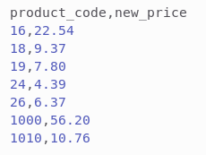

# ShopperTest API Documentation

- [ShopperTest API Documentation](#shoppertest-api-documentation)
  - [Apresentation](#apresentation)
      - [Backend para aplicação WEB de restaurante fictício;](#backend-para-aplicação-web-de-restaurante-fictício)
  - [Features](#features)
  - [SQL Infos](#sql-infos)
      - [Instalação do MySQL 8](#instalação-do-mysql-8)
      - [Criar Banco de dados no MySQL](#criar-banco-de-dados-no-mysql)
    - [Tabelas utilizadas:](#tabelas-utilizadas)
  - [Enviroments Variables (.env)](#enviroments-variables-env)
    - [.env](#env)
    - [As seguintes variáveis devem ser alteradas no arquivo .env](#as-seguintes-variáveis-devem-ser-alteradas-no-arquivo-env)
  - [Primeiros passos](#primeiros-passos)
    - [Clonar repositório do github](#clonar-repositório-do-github)
    - [Iniciando a aplicação](#iniciando-a-aplicação)
  - [Paths](#paths)
    - ["/prices"](#prices)
      - [post](#post)
      - [post](#post-1)

<small><i><a href='http://ecotrust-canada.github.io/markdown-toc/'>Table of contents generated with markdown-toc</a></i></small>

## Apresentation
#### Backend para aplicação WEB de restaurante fictício;
- Desenvolvida em NodeJS v16.15.1;
- Banco de dados construido com o auxilio do Querry Builder Knex e MySQL 8;

## Features

- Upload de Arquivo .CSV;
- Análise de Arquivo .CSV com report de Erros e lista de Produtos para serem atualizados conforme arquivo .CSV;
- Análise de Arquivo .CSV com report de Erros, conforme critérios:
  - O novo preço de venda não pode ser inferior ao preço de custo;
  - O novo preço de venda não pode ser superior ou inferior em 10% em relação ao preço de venda atual;
  - Reajustes em pacotes de produtos devem ser transmitidos em cadeira para seus subprodutos;
  - Reajustes em produtos, quando contidos por algum pacote, devem ser transmitidos em cadeia para o seus pacotes;
  - Identificação de ausência de campos necessários do arquivo .csv;
  - Identificação se o código de algum produto contido no arquivo .csv não exite;
  - Identificação de valores numéricos inválidos;
- Atualização de banco de dados conforme Arquivo .CSV;

## SQL Infos

#### Instalação do MySQL 8

- [Guia de instalação Windows](https://www.alura.com.br/artigos/mysql-do-download-e-instalacao-ate-sua-primeira-tabela)
- [Guia de instalação Ubuntu](https://www.digitalocean.com/community/tutorials/how-to-install-mysql-on-ubuntu-20-04-pt)
- [Guia de instalação MacOS](https://medium.com/@viniciussantana_80882/instalando-mysql-em-um-mac-usando-homebrew-4a2d8d7dd1c9)

#### Criar Banco de dados no MySQL

> Como exemplo usarei o comando do prompt conforme sistemas baseados em Debian
- Abrir o terminal (Ctrl + Alt + T) e digitar: ```$ mysql -u root -p```
- Após digitar sua senha de acesso, digitar >```> CREATE DATABASE shopper```;

### Tabelas utilizadas:

- products: Armazena produtos com as colunas: code - name - cost_price - sales_price
  - Ex: ( code: 18, name: 'BEBIDA ENERGÉTICA VIBE 2L', cost_price: 8.09, sales_price 8.99 )
- packs: Armazena o endereço dos usuários com as colunas: id (auto incrementada) - pack_id - product_id - qty (quantidade do produto presente no pack)
  - Ex: ( pack_id: 1000, product_id: 18, qty: 6 )
  > O pack_id também é um produto
  
## Enviroments Variables (.env)

### .env

- Criar arquivo .env conforme arquivo exemple.env e adicionar as informações personalizadas

### As seguintes variáveis devem ser alteradas no arquivo .env

- DB_HOST: O endereço do host

> se não informado será utilizado '127.0.0.1'

- DB_USER: O nome do usuário onde está o banco de dados

> se não informado será utilizado 'root'

- DB_PASSWORD: A senha de acesso ao usuário MySQL (deve ser informado, obrigatóriamente)

## Primeiros passos

### Clonar repositório do github

[Diretório Github: ShopperTest](https://github.com/pedromsra/ShopperTest)

### Iniciando a aplicação

- Abrir terminal e digitar:
  - `$ cd /local_da_pasta_onde_a_API_está_salva;`
  - `$ npm install`;
  - `$ npm run dev`

> Para os fins dessa documentação será considerado o servidor local de enderço localhost:3010;

> Para alterar o servidor recomenda-se alterar no arquivo .env em PORT;

## Paths

### "/prices"

#### post

- endereço: localhost:3010/prices;
- info: upload de arquivo .csv, leitura do seu conteúdo e retornar erros (se existir) e os produtos listados (se válidos);
- Requisição esperada em Multipart com arquivo enviado na requisição com nome 'files' em formado .csv (exemplo):
  - exemplo de conteúdo do arquivo .csv:
    - 
  - Usando Insomnia ou Postgres:
    - Body: Multipart Form
      - name: files -> file: algum_arquivo.csv
    - Headers: 
      - header: Content-Type -> multipart/form-data

  - Pelo Front-End, por exemplo, com React:

```
    const csvFileUpload = new FormData() // criando um FormData
    csvFileUpload.append("files", csvFile) // Adicionando ao FormData o arquivo .csv com nome 'files'
    const response = await api.post(`/prices/`, csvFileUpload, { // Realizando a requisição post no servidor
      headers: {
        "Content-Type": "multipart/form-data", //definindo o header utilizado
      },
    });
```

- Resposta: JSON contendo a lista de erros e a lista de produtos encontrados no arquivo .csv, no formato, como exemplo:
  
```
{
  "products": [
    {
			"code": 1010,
			"name": "KIT ROLO DE ALUMINIO + FILME PVC WYDA",
			"sales_price": 10.76,
			"new_price": 10.76
		}
	],
	"errors": [
		{
			"error": "Produto de código 95 não encontrado (linha 7 do arquivo .csv)",
			"code": 95
		}
  ]
}
```

#### post

- endereço: localhost:3010/prices/update;
- info: Atualização das informações de preço (sales_price) dos produtos e packs informados no arquivo .csv;
- Requisição esperada em Body JSON (exemplo):

```
{
  "products": [
    {
			"code": 1010,
			"name": "KIT ROLO DE ALUMINIO + FILME PVC WYDA",
			"sales_price": 10.76,
			"new_price": 10.76
		}
	],
	"errors": [] //A lista de erros deve está vazia ou será retornado um erro 400
}
```

- Resposta: status(200).JSON('--quantidade de produtos atualizados--');